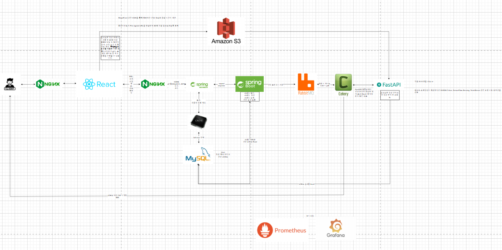

# 시스템 아키텍처 설계

[시스템 아키텍처](https://app.diagrams.net/#G18ZbX_vEPhxwmLp5PCGgwLAtkNea7AUOv#%7B%22pageId%22%3A%22o9nVMiYvh9nc5dTBIp0Q%22%7D)

* WS : Nginx

  * HTTPS를 위한 SSL이 필요
  * 정적 컨텐츠 캐싱을 통해 WAS 과부하 줄이고 싶음
  * 리버스 프록시를 통해 보안성 확보
  * 상담 예약까지 사용하는 경우, 채류 시간이 길어서 동시 커넥션이 많을듯함 > 동시 이벤트 기반 웹 서버가 필요

* Web Framework : Spring Boot

  * 비즈니스 로직이 복잡함
  * 트랜잭션 처리가 많음

* RDB : MySQL

  * Entity간 관계가 복잡함
  * Read 작업이 CUD 작업보다 많음

* 보안 : Spring Security + JWT

  * CORS
  * allowed 요청 설정
  * 인증 : JWT
  * 인가 : role

* Caching : Local Caching

  * 사용자 정보 중복 조회가 많음
  * scale out 전략은 안쓸듯하여 redis와 같은 db에 따로 저장할 필요가없음
  * 다른 db보다 조회 성능이 좋음 

* Message Queue

  비동기 논블로킹 방식이 필요함

  * AI 서버의 응답속도가 느릴 것으로 예상
  * AI 서버가 리소스를 많이 먹을 것을 예상

* 알림 서비스 : FCM

  * 서버 부하를 최대한 줄이고 싶음
    * Polling : 커넥션을 연결하고 끊고 하는 작업이 많음
    * SSE : 커넥션을 일정시간동안 연결하고 끊음
    * FCM : 커넥션 관리를 서버단에서 하지 않고 외부 클라우드에서 관리함
  * 빠르게 개발하고 싶음

# API 명세서 작성

[기능 명세서](https://docs.google.com/spreadsheets/d/1ckOcJWDPMjA6_Pc7LZJzGnyyDdSG2hD4ARhsodP1tCc/edit?gid=1400022260#gid=1400022260)

[API 명세서](https://www.notion.so/API-1a7e0af0747e80b1a7d8db53b777ecfd)

* 기능 명세서 기반으로 도메인 별로 나눠서 작성
  * 회원관리
  * 마이페이지
  * 의뢰
  * 상담
  * 알림함
  * 과실비율 분석
  * 결제

# ERD 작성

[ERD](https://www.erdcloud.com/d/JThW2mJj7unb9BAvf)

API 명세서 기반으로 erdcloud에서 작성

1. Entity 부터 작성
2. Entity의 Column 설계
3. Entity간 관계 설계

# 앞으로 해볼 거
* RabbitMQ, Celery, Spring Boot, Fast API를 활용해서 비동기 논블로킹 테스트
* FCM을 통해 알림 보내보기
